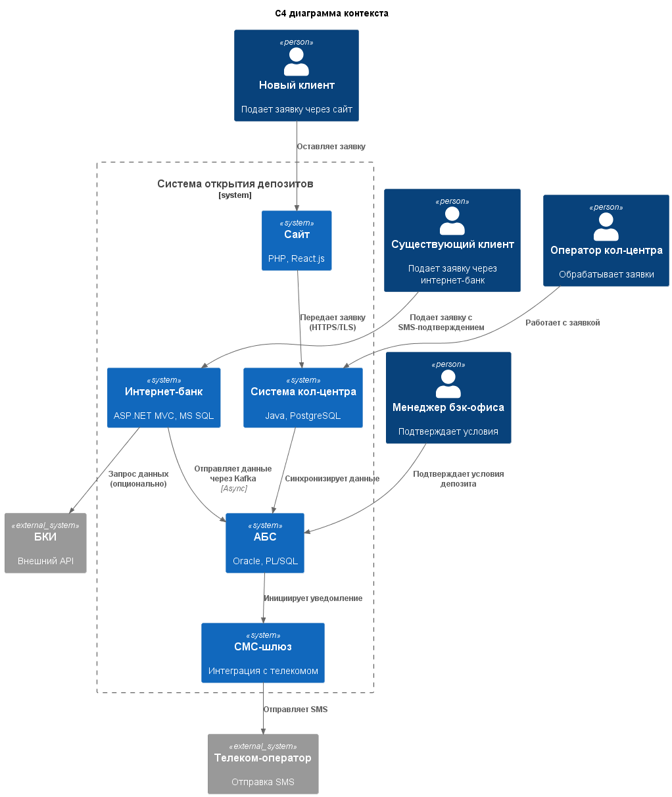
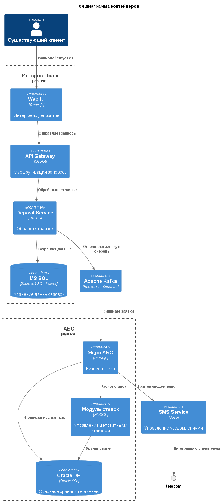

### **Название задачи:**  
Проектирование архитектуры MVP открытия депозитов  
### **Автор:**  
Архитектурная команда банка "Стандарт"  
### **Дата:**  
2025-07-11  

### **Функциональные требования**  

| № | Действующие лица/системы        | Use Case                          | Описание                                                                 |
|---|---------------------------------|-----------------------------------|--------------------------------------------------------------------------|
| 1 | Новый клиент                    | Подача заявки через сайт          | Клиент вводит ФИО и телефон → Заявка шифруется и передаётся в кол-центр  |
| 2 | Существующий клиент             | Подача заявки через интернет-банк | Выбор счёта/суммы → SMS-подтверждение → Передача в очередь обработки     |
| 3 | Оператор кол-центра             | Обработка заявки с сайта          | Просмотр заявки → Звонок клиенту → Фиксация особых условий               |
| 4 | Менеджер бэк-офиса              | Подтверждение условий депозита    | Проверка заявки → Расчет ставки в АБС → Подтверждение → SMS-уведомление  |
| 5 | АБС                             | Хранение актуальных ставок        | Централизованное управление ставками вместо XLS-файлов                   |
| 6 | Система уведомлений             | Отправка SMS клиенту              | Триггер на изменение статуса → Формирование сообщения → Отправка         |

### **Нефункциональные требования**  

| № | Требование                                                                 |
|---|----------------------------------------------------------------------------|
| 1 | Время обработки заявки ≤ 500 мс (UI)                                       |
| 2 | Доступность 99.9% для интернет-банка                                       |
| 3 | Шифрование данных при передаче (TLS 1.3+)                                  |
| 4 | Запрет прямой интеграции с API АБС                                         |
| 5 | Резервное копирование данных каждые 15 минут                               |
| 6 | Поддержка 5000 одновременных сессий                                        |
| 7 | Использование существующих СУБД (MS SQL/Oracle)                            |

### **Решение**

### Обоснование решений:

1. Асинхронная интеграция через Kafka:

* Соответствует требованию R1 (запрет прямого доступа к АБС)
* Позволяет буферизовать нагрузку при пиковых запросах
* Совместимо с существующей экспертизой Java в банке

2. Микросервисная архитектура для интернет-банка:

* Изолирует новый функционал от монолита
* Позволяет независимо масштабировать модуль депозитов
* Соответствует требованию S3

3. Централизация ставок в АБС:

* Устраняет ручное управление XLS-файлами
* Обеспечивает единый источник истины
* Использует существующие компетенции PL/SQL

4. Шифрование данных:

* TLS 1.3 для передачи данных
* AES-256 для хранения чувствительной информации
* Соответствует требованию R2

### Альтернативы
Вариант 1: Прямая интеграция Интернет-банка с АБС

Недостатки:

* Риск перегрузки АБС и нарушения доступности (нарушает R1)
* Невозможность обработки пиковых нагрузок
* Нарушение архитектурного ограничения

Вариант 2: Интеграция АБС и Интернет банка через файловое хранилище

Недостатки:

* Задержки до 24 часов в обработке
* Риски потери данных при сбоях
* Не соответствует требованию U2 (время отклика ≤500 мс)

Вариант 3: GraphQL API-шлюз

Преимущества:

* Единая точка входа для всех систем
* Гибкость запросов данных

Недостатки:

* Требует внедрения новой технологии
* Дополнительная точка отказа
* Не решает проблему нагрузки на АБС

### Недостатки, ограничения, риски выбранного решения

1. Технологический риск:

    Недостаток экспертизы Kafka в команде (требуется обучение)

    Обходной путь: Привлечение консультантов на начальном этапе

2. Производительность:

    Задержки до 5 мин при асинхронной обработке через Kafka

    Обходной путь: Приоритизация депозитных сообщений в очередях

3. Ограничения АБС:

    Вертикальное масштабирование Oracle может стать узким местом

    Обходной путь: Внедрение read replica для офлайн-запросов

4. Безопасность:

    Риск утечек при передаче данных в кол-центр

    Обходной путь: Шифрование PII-данных в покое и движении

5. Совместимость:

    Текущая версия .NET Framework в интернет-банке ограничивает использование современных библиотек
    
    Обходной путь: Постепенная миграция на .NET 6 для нового функционала