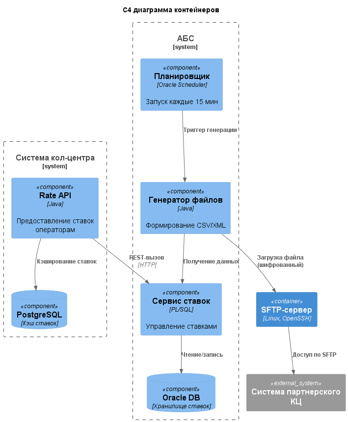

### **Название задачи:**  
Интеграция кол-центров с системой актуальных ставок по депозитам  
### **Автор:**  
Архитектурная команда банка "Стандарт"  
### **Дата:**  
2025-07-11 

### **Функциональные требования**  

| № | Действующие лица/системы        | Use Case                          | Описание                                                                 |
|---|---------------------------------|-----------------------------------|--------------------------------------------------------------------------|
| 1 | Оператор кол-центра             | Консультация по ставкам           | Просмотр актуальных ставок в системе кол-центра                          |
| 2 | Администратор АБС               | Обновление ставок                 | Корректировка ставок в АБС                                               |
| 3 | Система партнерского кол-центра | Получение файла со ставками       | Автоматическая загрузка файла через SFTP                                 |
| 4 | Партнерский оператор            | Консультация клиента              | Использование актуальных ставок из файла                                 |
| 5 | Планировщик задач               | Генерация файла ставок            | Автоматическое создание файла каждые 15 минут                            |

### **Нефункциональные требования**  

| № | Требование                                                                 |
|---|----------------------------------------------------------------------------|
| 1 | Обновление ставок в кол-центрах в течение 15 минут после изменения         |
| 2 | Шифрование файлов при передаче (PGP/GPG)                                   |
| 3 | Надежность передачи файлов (повторные попытки при сбоях)                   |
| 4 | Совместимость формата файла (CSV/XML) с системой партнера                  |
| 5 | Разграничение доступа к ставкам для разных кол-центров                     |

### **Решение**

### **Обоснование решений**

1. API для внутреннего кол-центра:

* Прямой доступ к ставкам через REST API
* Кэширование данных в PostgreSQL для снижения нагрузки на АБС
* Соответствует требованию реального времени

2. SFTP для партнерского кол-центра:

* Автоматическая генерация файлов каждые 15 минут
* Шифрование PGP/GPG для защиты данных
* Совместимость с ограничениями партнера

3. Гибкий формат файлов:

* Поддержка CSV и XML по выбору партнера
* Автоматическая конвертация данных

4. Изолированное обновление:

* Минимальные изменения в АБС через новый PL/SQL-сервис
* Отдельный Java-модуль для генерации файлов

### **Альтернативы**

Вариант 1: Единый SFTP для всех кол-центров

Недостатки:

* Нет реального доступа к данным для внутреннего кол-центра
* Ручное обновление файлов операторами
* Не соответствует требованию оперативности

Вариант 2: Репликация данных в отдельную БД

Преимущества:

* Высокая производительность
* Централизованный доступ

Недостатки:

* Сложность реализации
* Задержки синхронизации
* Дополнительная инфраструктура

Вариант 3: Веб-портал для партнеров

Недостатки:

* Требует разработки новой системы
* Не соответствует ограничениям партнера (только файлы)
* Длительная реализация

### **Недостатки, ограничения, риски**
1. Задержка данных у партнера:

    Максимум 15 минут между обновлениями

    Обходной путь: Четкое информирование клиентов о времени актуальности данных

2. Безопасность файлов:

    Риск перехвата при передаче

    Обходной путь: Обязательное шифрование PGP + VPN-туннель

3. Нагрузка на АБС:

    Генерация файлов может создавать пиковую нагрузку

    Обходной путь: Запуск в периоды низкой активности

4. Совместимость форматов:

    Риск несоответствия требованиям партнера

    Обходной путь: Гибкая система конфигурации форматов

5. Мониторинг передачи:

    Сложность отслеживания успешности доставки

    Обходной путь: Система нотификации о сбоях

### Список крупных задач по системам: 

АБС:

1. Разработка PL/SQL-сервиса управления ставками
2. Реализация API для внутреннего доступа
3. Создание модуля генерации файлов (Java)
4. Интеграция с Oracle Scheduler
5. Реализация шифрования PGP/GPG

Система кол-центра:

1. Разработка UI для отображения ставок
2. Интеграция с Rate API
3. Реализация кэширования в PostgreSQL
4. Настройка механизма обновления данных

Инфраструктура:

1. Развертывание SFTP-сервера
2. Настройка VPN для партнера
3. Конфигурация автоматической очистки файлов
4. Внедрение мониторинга передачи

Партнерский кол-центр:

1. Настройка автоматической загрузки файлов
2. Интеграция парсера CSV/XML
3. Обновление интерфейса оператора
4. Тестирование механизма обновления

