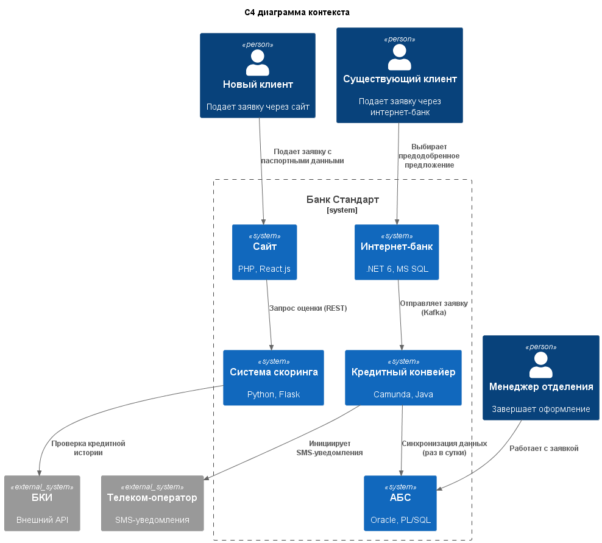
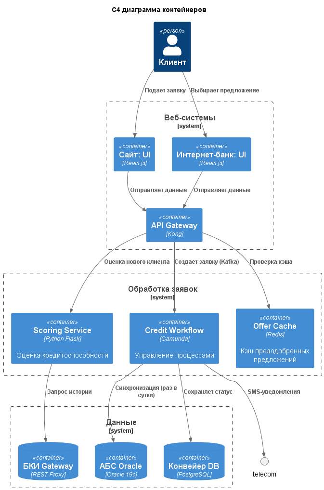

### **Название задачи:**  
Проектирование архитектуры онлайн-кредитования  
### **Автор:**  
Архитектурная команда банка "Стандарт"  
### **Дата:**  
2025-07-11   

### **Функциональные требования**  

| № | Действующие лица/системы  | Use Case                          | Описание                                                                 |
|---|---------------------------|-----------------------------------|-------------------------------------------------------------------------|
| 1 | Новый клиент              | Подача заявки на сайте            | Ввод ФИО, телефона, паспорта → Мгновенное решение → SMS-приглашение     |
| 2 | Существующий клиент       | Подача предодобренной заявки      | Выбор предложения → SMS-подтверждение → Ускоренная обработка            |
| 3 | Система скоринга          | Автоматическая оценка             | Анализ данных клиента + запрос в БКИ → Кредитный рейтинг                |
| 4 | Кредитный конвейер        | Обработка заявки                  | Проверка документов → Принятие решения → Уведомление                    |
| 5 | Менеджер отделения        | Продолжение онлайн-заявки         | Поиск заявки по ID → Завершение оформления                              |
| 6 | АБС                       | Фиксация договора                 | Создание кредитного договора → Передача в бухгалтерию                   |

### **Нефункциональные требования**  

| № | Требование                                                                 |
|---|----------------------------------------------------------------------------|
| 1 | Время принятия решения для новых клиентов ≤ 15 сек                         |
| 2 | Обработка предодобренных заявок в течение 4 часов                          |
| 3 | Защита паспортных данных (AES-256 + TLS 1.3)                               |
| 4 | Изоляция системы скоринга от фоновых расчетов                              |
| 5 | Совместимость с суточной синхронизацией АБС-Конвейер                       |
| 6 | Автоматическое масштабирование под пиковые нагрузки (до 200 заявок/мин)    |

### **Архитектурно значимые требования (ASR)**  

| ASR | Требование                                      | Категория | Обоснование                                                      |
|-----|-------------------------------------------------|-----------|------------------------------------------------------------------|
| 1   | Асинхронная обработка через Kafka               | S         | Избежание прямой нагрузки на АБС                                 |
| 2   | Кэширование предодобренных предложений          | P         | Ускорение обработки для существующих клиентов                    |
| 3   | Circuit Breaker для интеграции с БКИ            | R         | Защита от сбоев внешнего сервиса                                 |
| 4   | Read Replica кредитного конвейера               | P         | Обеспечение производительности при росте нагрузки                |
| 5   | Шлюз аутентификации для паспортных данных       | +R        | Соответствие закону о персональных данных                        |

### **Решение**

### Обоснование решений:

1. Двойной путь обработки:

* Для новых клиентов: Сайт → Скоринг → Мгновенное решение
* Для существующих: Интернет-банк → Кэш предложений → Асинхронная обработка

Соответствует: Требованию изоляции скоринга (ASR3) и ограничению нагрузки

2. Кэширование предодобренных предложений:

* Расчет ночью в период низкой нагрузки
* Хранение в Redis для быстрого доступа

Соответствует: Требование P2 (обработка ≤4 часов)

3. Асинхронная модель:

* Kafka для буферизации заявок
* Отдельный Camunda-процесс для workflow

Соответствует: Ограничению R4 (суточная синхронизация с АБС)

4. Защита данных:

* Шлюз аутентификации для верификации паспортов
* Шифрование PII-данных в движении и покое

Соответствует: Требованию R3 и закону о персональных данных

### Альтернативы
Вариант 1: Прямая интеграция с АБС

Недостатки:

* Нарушение запрета прямой интеграции (FURPS+ R1)
* Риск перегрузки основной системы
* Несовместимо с суточной синхронизацией

Вариант 2: Централизованный кредитный хаб

Преимущества:

* Унифицированное управление процессами

Недостатки:

* Создает единую точку отказа
* Требует 6+ месяцев разработки
* Не решает проблему изоляции скоринга

Вариант 3: Полностью синхронная модель

Недостатки:

* Невозможно достичь времени отклика ≤15 сек
* Блокирует UI при ожидании БКИ
* Увеличивает риск сбоев

### Ограничения решения

1. Временные задержки:

    Данные в АБС обновляются только раз в сутки
    Обходной путь: Нотификация клиентов о возможных расхождениях

2. Ограничения скоринга:

Только базовые параметры для новых клиентов
Обходной путь: Уточнение данных при визите в отделение

3. Безопасность паспортных данных:

    Зависимость от внешних сервисов верификации
    Обходной путь: Локальное хранение только хешей

4. Совместимость с legacy:

    Ограниченная интеграция с текущим интернет-банком
    Обходной путь: Промежуточный API-шлюз

5. Масштабируемость БКИ:

    Квоты на количество запросов
    Обходной путь: Кэширование результатов

